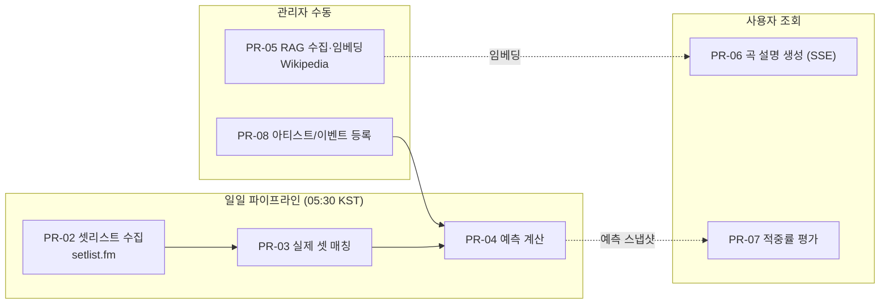
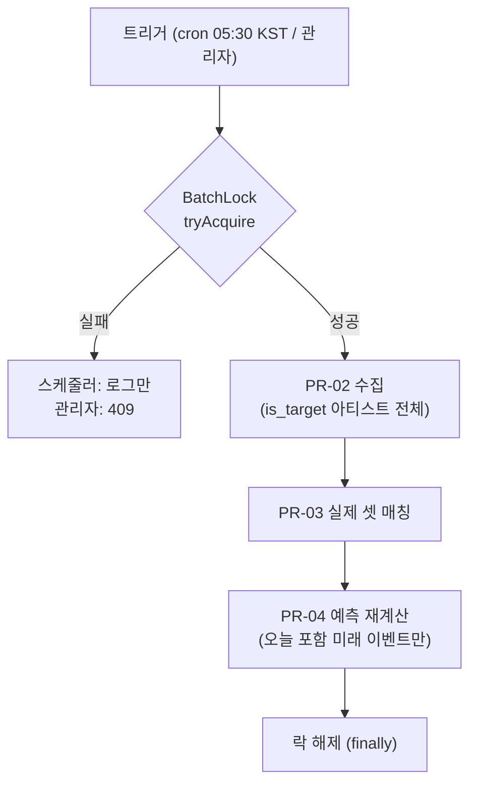
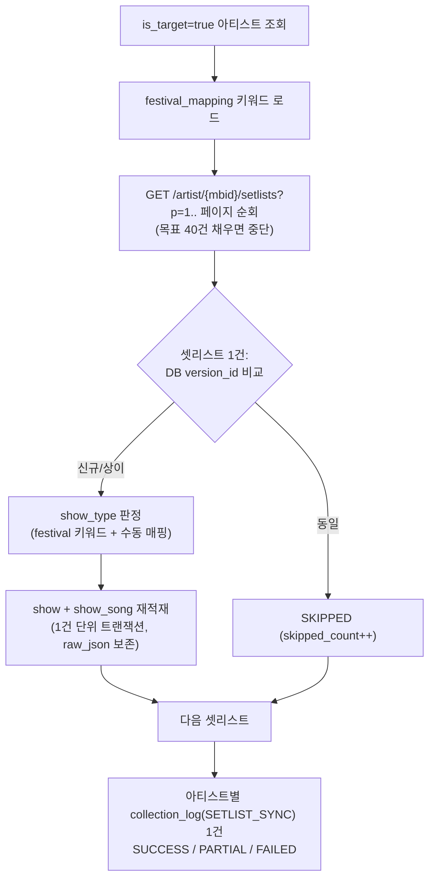
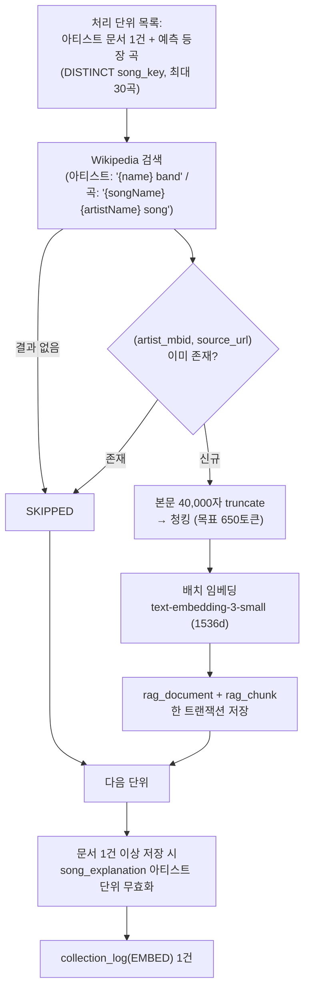
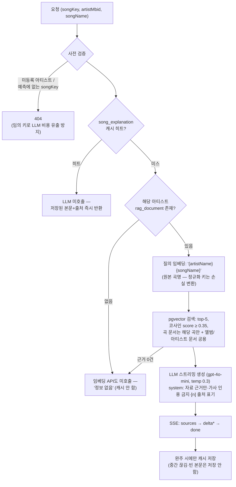

# 프로세스 정의서 — Soundcheck

- 프로젝트: Soundcheck (내한 페스티벌 셋리스트 예측 & 예습 서비스)
- 작성일: 2026-07-30
- 버전: v1.0
- 작성 방식: **구현 완료된 프로토타입을 역설계**하여 문서화. 실제 코드(`/backend/src/main/java/com/encore`)를 원본으로 하며, 불일치 시 코드 기준으로 갱신한다.
- 관련 문서: `/docs/design/table-spec.md`, `/docs/design/api-spec.md`, `/docs/setlist-prd.md`

---

## 1. 프로세스 목록

| ID | 프로세스 | 트리거 | 실행 방식 | 이력 |
|----|----------|--------|-----------|------|
| PR-01 | 일일 파이프라인 (수집→매칭→예측) | 스케줄 매일 05:30 KST / 관리자 수동 | 비동기 (프로세스 내 락) | collection_log |
| PR-02 | 셋리스트 수집 | PR-01의 1단계 | 아티스트 단위 순회, 셋리스트 1건 단위 트랜잭션 | SETLIST_SYNC |
| PR-03 | 실제 셋리스트 매칭 (적중률 검증 준비) | PR-01의 2단계 | 동기 | — |
| PR-04 | 예측 계산 | PR-01의 3단계 / 이벤트 등록 시 즉시 | 이벤트 단위 트랜잭션 | PREDICT |
| PR-05 | RAG 문서 수집·임베딩 | 관리자 수동 (스케줄 없음) | 비동기 (별도 락) | EMBED |
| PR-06 | 곡 설명 생성 (RAG 검색+생성) | 사용자 곡 상세 조회 (SSE) | 온라인, 캐시 우선 | — |
| PR-07 | 적중률 평가 | 사용자/아카이브 조회 시 | 온라인 계산 (순수 함수) | — |
| PR-08 | 아티스트/이벤트 등록 | 관리자 | 동기 | — |

### 전체 흐름



---

## 2. PR-01 일일 파이프라인

- **트리거**: ① `@Scheduled` cron `0 30 5 * * *` (Asia/Seoul, 설정 `encore.collect.cron`) — 애플리케이션의 유일한 스케줄 ② `POST /api/admin/batch/collect`
- **동시 실행 제어**: 프로세스 내 `AtomicBoolean` CAS 락(`BatchLock`). 획득 실패 시 스케줄러는 로그만 남기고, 관리자 API는 409를 반환한다. 단일 인스턴스 배포 전제 — 다중 인스턴스로 확장 시 DB 락으로 교체 필요.
- **실행**: 락 획득 → 태스크 익스큐터에 제출(제출 실패 시 락 즉시 해제) → `수집 → 매칭 → 예측` 순차 실행 → finally에서 락 해제.
- **날짜 기준**: "오늘" 판정은 서버 타임존이 아닌 **KST 고정**(`KoreaTime`) — cron 타임존과 동일 기준.



---

## 3. PR-02 셋리스트 수집

**목적**: `is_target = true`인 아티스트별로 setlist.fm에서 최근 공연 N회(기본 40, `encore.collect.recent-shows-limit`)를 수집·정제해 `show`/`show_song`에 적재.

### 3.1 처리 절차



### 3.2 규칙 상세

| 항목 | 규칙 |
|------|------|
| 변경 감지 | `version_id` 동일 → 스킵. 상이/신규 → 전량 갱신(showType은 재판정 값 사용) + 곡 목록 통째 교체 |
| 날짜 파싱 | `eventDate`(`dd-MM-yyyy`)를 `ResolverStyle.STRICT`로 파싱 — 불가능한 날짜는 실패 처리. 문자열 정렬 금지 |
| 곡 변환 | setIndex/positionInSet/positionTotal 부여. 곡명 공백은 스킵(원본은 raw_json에 남음). `song_key = SongKeys.normalize(원본)`. **tape 곡도 저장**하고 플래그로만 구분(제외는 예측 단계 책임) |
| show_type 판정 | NFKC+소문자 정규화한 `venue명 + tour명`에 내장 키워드(`festival`, `페스티벌`) 또는 `festival_mapping` 키워드 포함 → FESTIVAL, 아니면 UNKNOWN. SOLO 자동 판정 없음 |
| 페이징 종료 | `total` 도달 시 중단. `404 && page > 1`은 정상 종료(마지막 페이지 초과), **첫 페이지 404는 MBID 오류로 실패 처리** |

### 3.3 외부 API 정책 (setlist.fm)

| 항목 | 값 | 설정 키 |
|------|-----|---------|
| 인증/포맷 | `x-api-key` + `Accept: application/json` (미지정 시 XML) | `setlist-fm.api-key` |
| 최소 요청 간격 | 500ms (synchronized 강제) | `setlist-fm.min-request-interval` |
| 재시도 대상 | **429, 5xx만** — 그 외 4xx 즉시 실패 | |
| 백오프 | 지수: 1s → 2s → 4s, 최대 3회 | `setlist-fm.initial-backoff`, `max-retries` |
| 원본 보존 | 목록 응답을 문자열로 수신 → 항목별 노드 원문을 `raw_json`에 저장 | |

### 3.4 오류 격리 (부분 실패 허용)

- 아티스트 1팀 실패가 다음 아티스트로 번지지 않는다 (FAILED 로그 저장 후 continue).
- 부분 수신 후 실패해도 받은 것은 반영하고 PARTIAL. 0건 수신 + 오류면 FAILED.
- 로그 저장 자체가 실패하면 애플리케이션 로그만 남기고 진행.

---

## 4. PR-03 실제 셋리스트 매칭

**목적**: 공연일이 지난 `target_event` 중 `actual_setlist_id`가 비어 있는 건에 대해, 같은 아티스트·같은 공연일의 수집 공연을 자동 연결 → 적중률 검증 가능 상태로 전환.

- 후보가 여럿이면 **실연주 곡 수(tape 제외)가 최대**인 공연 선택, 동수면 setlistId 순으로 결정적 선택.
- 곡 0건 공연은 정답이 될 수 없으므로 제외.
- 연결되는 순간 해당 이벤트는 `verified = true`로 조회되고, 화면은 "예측 vs 실제" 검증 모드로 전환된다.

## 5. PR-04 예측 계산

**목적**: 이벤트별 곡 연주 확률을 사전 계산해 `prediction`에 스냅샷으로 저장.

### 5.1 대상·표본

| 항목 | 규칙 |
|------|------|
| 대상 이벤트 | `event_date ≥ 오늘(KST)` — **지난 이벤트는 재계산하지 않음** (예측 스냅샷 고정 → 사후 검증의 공정성 보장) |
| 표본 | 아티스트의 최근 공연(eventDate desc, setlistId desc) 중 **곡 0건 공연 제외** 후 상위 `sample-size`(기본 20)회. 곡 상세 타임라인과 동일 규칙 공유 |
| 표본 없음 | `IllegalStateException` → 해당 이벤트 FAILED 로그, 다음 이벤트 계속 |

### 5.2 알고리즘 (순수 함수 `PredictionCalculator`)

```
공연 i (0-base, 최근순) 가중치:
  w_i = recencyDecay^i × (show_type == expected_show_type ? boost : 1.0)
       (기본: recencyDecay=0.95, boost=1.5)

곡 확률 = Σ(그 곡이 등장한 공연의 w_i) / Σ(전체 w_i)   → 정의상 0..1
```

| 규칙 | 내용 |
|------|------|
| tape 제외 | 집계 대상은 실연주 곡만 (`is_tape = false`). 커버곡은 포함 |
| 중복 등장 | 한 공연에 같은 곡 2회(메들리/리프라이즈) → 1회로 세고 첫 위치 사용 |
| 표시 이름 | 최근 공연에서 처음 만난 원본 표기 사용 |
| 반올림 | probability scale 4, avg_position scale 1, encore_ratio scale 4 — 전부 HALF_UP |
| 순위 | 확률 ↓ → played_count ↓ → song_key ↑ (결정적), rank 1부터 |
| 근거 보존 | `evidence` JSONB에 파라미터·공연별 가중치 전량 저장 (Explainable AI 원천) |
| 파라미터 검증 | recencyDecay ∈ (0,1], boost ≥ 1.0 — 위반 시 즉시 예외 |

### 5.3 저장

- 이벤트 단위 트랜잭션에서 **전체 교체**: 벌크 JPQL DELETE(즉시 실행) → INSERT. 파생 deleteBy는 Hibernate 실행 순서 문제로 유니크 충돌하므로 사용 금지.
- 이벤트 1건당 `collection_log(PREDICT)` 1건: fetched=표본 수, updated=저장 곡 수.

### 5.4 파라미터 튜닝

`sample-size` / `recency-decay` / `matching-show-type-boost`는 설정으로 노출 — 8월 초 펜타포트 실제 셋리스트를 정답셋으로 채점해 조정한다 (기록: `/docs/tuning-log.md`).

---

## 6. PR-05 RAG 문서 수집·임베딩

**목적**: 아티스트·예측 등장 곡의 배경 문서를 Wikipedia(영문)에서 수집 → 청킹 → 임베딩 → pgvector 저장.
**트리거**: `POST /api/admin/batch/rag-ingest`만 (스케줄 없음 — LLM/API 비용은 운영자가 통제). 수집 파이프라인과 **별도 락**.

### 6.1 처리 절차 (아티스트 1팀 기준)



### 6.2 규칙 상세

| 항목 | 규칙 |
|------|------|
| 곡 선정 | **prediction 테이블에 등장한 곡만** (예측과 무관한 곡에 비용 지출 방지), 최대 `max-songs-per-artist`(30) |
| 중복 방지 | UNIQUE(artist_mbid, source_url) 사전 검사 — 여러 곡이 같은 앨범 문서로 수렴하는 경우 스킵 |
| doc_type 판정 | 아티스트 단위 → ARTIST. 제목에 `album)`/`(ep)` 포함 → ALBUM. 그 외 → SONG |
| 청킹 | Spring AI TokenTextSplitter, 목표 650토큰(상한), 최소 350자. 토큰 계산은 임베딩과 동일한 CL100K_BASE |
| 캐시 무효화 | 부분 실패여도 문서가 저장됐으면 반드시 수행 (실패는 로그만) — 새 근거가 기존 캐시된 설명에 반영되도록 |
| Wikipedia 정책 | UA에 프로젝트명+연락처, 최소 간격 1000ms, **429만** 재시도(Retry-After 존중, 기본 5s·상한 60s·최대 3회) |

---

## 7. PR-06 곡 설명 생성 (RAG 검색 + 생성)

**목적**: 곡 상세 화면의 "곡 이야기" — 검색된 출처에 근거한 설명을 SSE로 스트리밍.
**트리거**: `GET /api/songs/{songKey}/explanation` (사용자 조회 시).

### 7.1 처리 절차



### 7.2 환각 방지 원칙 (PRD §8)

| 원칙 | 구현 |
|------|------|
| 출처 없는 생성 금지 | system 프롬프트: 제공 자료만 근거, 부족하면 정확히 `"정보 없음"` 응답 (프론트도 이 문자열로 빈 상태 판별) |
| 출처 추적성 | 출처 목록 순서 = 프롬프트 자료 번호 순서(URL 중복 제거) → 본문 `[n]`이 출처 n번째와 일치 |
| 저작권 | 가사 원문 인용 금지 — 해석·배경만 |
| 비용 통제 | 캐시 우선 / 근거 없으면 LLM·임베딩 미호출 / 예측에 없는 곡 404 / "정보 없음"은 캐시하지 않음(문서 수집 즉시 반영) |

## 8. PR-07 적중률 평가

**목적**: `actual_setlist_id`가 연결된 이벤트의 예측 성적 계산 (순수 함수 `AccuracyCalculator`, 조회 시 온라인 계산).

| 지표 | 정의 |
|------|------|
| `topK` | min(실제 연주 곡 수, 예측 곡 수) |
| `precisionAtK` | 예측 상위 K곡 중 실제 연주된 곡 비율 — 헤드라인 지표 |
| `recall` | 실제 연주 곡 중 예측 목록(전체)에 있던 비율 |
| `surprises` | 예측 목록에 없던 실연주 곡 (실제 위치 오름차순) |

- 실제 셋 곡도 tape 제외 + 리프라이즈 첫 위치만 — 예측 집계와 동일 규칙.
- scale 4, HALF_UP. 실연주 곡 0이면 평가 불가(예외).
- 확장 예정(P1): F1 = 2·P·R/(P+R), Top-N Accuracy. Accuracy(정분류율)는 TN이 정의되지 않아 채택하지 않음.

## 9. PR-08 아티스트/이벤트 등록 (관리자)

**아티스트 등록**: setlist.fm 검색(`search/artists`) → 후보 표시(첫 결과가 본체라는 보장이 없어 disambiguation 병기) → MBID로 등록(기존 존재 시 프로필 갱신+대상 복귀) → 프론트가 수집 배치 자동 트리거.

**이벤트 등록** (`POST /api/admin/events`, 동기):

1. `event_date < 오늘(KST)` → 400 (사후 예측 방지 — 공연이 끝난 뒤 등록해 적중률을 조작하는 경로 차단)
2. 아티스트 미등록 → 404
3. `saveAndFlush`로 UNIQUE(artist_mbid, event_date) 충돌을 즉시 409로 전환
4. 매칭+예측을 **동기 실행** → 응답의 `predictionStatus`(SUCCESS/FAILED)로 즉시 결과 확인

**내한 감지**: 수집된 `show` 중 `country_code = 'KR'` 공연을 후보로 제시 → 원클릭으로 이벤트 등록 (이벤트명 "{아티스트} 내한 공연" 자동 조립, showType 승계).

---

## 10. 공통 정책

### 10.1 배치 이력 (collection_log)

- 진행 중 상태 없음 — **완료 시점 1건 기록** 모델. 진행 여부는 락 상태(`collecting`/`ragIngesting`)로 API 노출.
- 상태 판정: 오류 0건 SUCCESS / 일부 오류 PARTIAL(메시지 `;` 결합) / 전량 실패 FAILED.
- job_type별 카운트 의미는 테이블설계서 §4.7 참조.

### 10.2 시간 기준

- 스케줄·"오늘" 판정 모두 **Asia/Seoul 고정** — 서버 타임존과 무관.

### 10.3 실패 격리 원칙

- 순회형 배치(수집·예측·RAG)는 단위(아티스트/이벤트) 실패를 격리하고 계속 진행한다.
- 외부 API 재시도는 일시 장애(429/5xx)만 — 클라이언트 오류(4xx)는 즉시 실패로 드러낸다.

### 10.4 주요 파라미터 (설정 키)

| 키 | 기본값 | 의미 |
|----|--------|------|
| `encore.collect.cron` | `0 30 5 * * *` (KST) | 일일 파이프라인 |
| `encore.collect.recent-shows-limit` | 40 | 아티스트당 수집 목표 |
| `encore.prediction.sample-size` | 20 | 예측 표본 |
| `encore.prediction.recency-decay` | 0.95 | 최신성 감쇠 |
| `encore.prediction.matching-show-type-boost` | 1.5 | 유형 일치 부스트 |
| `encore.rag.top-k` / `min-score` | 5 / 0.35 | 검색 폭·유사도 하한 |
| `encore.rag.chunk-target-tokens` | 650 | 청크 크기 |
| `encore.rag.max-songs-per-artist` | 30 | RAG 곡 상한 |
| `setlist-fm.min-request-interval` | 500ms | 레이트 리밋 |
