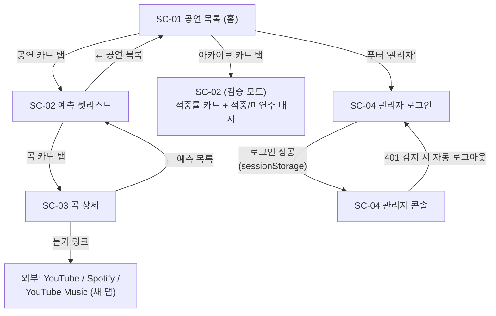

# 화면설계서 — Soundcheck

- 프로젝트: Soundcheck (내한 페스티벌 셋리스트 예측 & 예습 서비스)
- 작성일: 2026-07-30
- 버전: v1.0
- 작성 방식: **구현 완료된 프로토타입(MVP)을 역설계**하여 문서화. 코드가 원본이며, 이 문서는 코드와 불일치 시 코드를 기준으로 갱신한다.
- 대상 소스: `/frontend/src` (React 19 + TypeScript + Vite, react-router, TanStack Query v5)

---

## 1. 화면 목록

| 화면 ID | 화면명 | 경로 | 컴포넌트 | 접근 |
|---------|--------|------|----------|------|
| SC-01 | 공연 목록 (홈) | `/` | `EventListPage` | 공개 |
| SC-02 | 예측 셋리스트 | `/events/:eventId` | `PredictionsPage` | 공개 |
| SC-03 | 곡 상세 | `/events/:eventId/songs/:songKey` | `SongPage` | 공개 |
| SC-04 | 관리자 콘솔 | `/admin` | `AdminPage` (로그인 게이트 + 콘솔) | Basic 인증 |

- 라우트 정의: `frontend/src/App.tsx`
- 미정의 URL에 대한 404 전용 화면은 현재 없음 (§8 개선 항목 참조)

### 1.1 화면 흐름도



---

## 2. 공통 레이아웃 / 디자인 원칙

모든 화면은 동일한 셸을 공유한다 (`App.tsx`, `index.css`).

```
┌──────────────────────────────────┐
│ Soundcheck 셋리스트 예측            │  ← 헤더: 로고(홈 링크) + 서브텍스트
├──────────────────────────────────┤
│                                  │
│         (본문: 라우트 영역)        │  ← max-width 640px 단일 컬럼
│                                  │
├──────────────────────────────────┤
│ setlist data from setlist.fm ·   │  ← 푸터: 출처 표기(약관 의무) +
│ 관리자                            │     관리자 진입 링크
└──────────────────────────────────┘
```

| 항목 | 결정 | 근거 |
|------|------|------|
| 레이아웃 | 모바일 우선, `max-width: 640px` 단일 컬럼 | 공연장에서 폰으로 보는 시나리오 (PRD §9) |
| 테마 | 다크 전용 (`color-scheme: dark`, 배경 `#0e1016`, 포인트 `#f5b14c`) | 공연장(어두운 환경) 사용 최적화 |
| 네비게이션 | 탭바/드로어 없음. 카드 링크 + 페이지 상단 `← 뒤로` 링크 | 화면 4개 규모에 과한 구조 배제 |
| 출처 표기 | 푸터에 setlist.fm 고정 노출 | setlist.fm 비상업 무료 사용 조건 |
| 접근성 | `role="status"/"alert"`, `aria-pressed`, 최소 탭 타깃 44px, `prefers-reduced-motion` 대응, 앵커 내부 버튼 중첩 회피 | 모바일 실사용 품질 |

### 2.1 공용 컴포넌트

| 컴포넌트 | 역할 | 사용 화면 |
|----------|------|-----------|
| `StatusView` | 로딩(스피너) / 에러(재시도 버튼) / 빈 상태의 통일 표현. 공연장 네트워크가 느린 것을 전제로 재시도 버튼을 크게 배치 | SC-01, SC-02, SC-03 |
| `ProbabilityBar` | 확률 시각화 막대. `aria-hidden` 장식용 — 수치는 항상 텍스트로 병기 | SC-02 (확률순 모드) |

### 2.2 상태 소유 규칙

| 상태 종류 | 저장소 | 예 |
|-----------|--------|-----|
| 서버 상태 | TanStack Query (별도 전역 스토어 없음) | 공연 목록, 예측, 적중률 |
| 화면 로컬 상태 | `useState` | 보기 모드 토글, 폼 입력 |
| 기기 개인 상태 | `localStorage` | 예습 체크 `encore-practice-{eventId}` |
| 세션 한정 상태 | `sessionStorage` | 관리자 Basic 인증 `encore-admin-auth` |
| 세션 내 캐시 | 모듈 레벨 Map | 곡 이야기(SSE) 재방문 캐시 |

- 전역 `staleTime: 60초` — 예측은 배치가 일 1회 갱신하는 데이터이므로 잦은 refetch 불필요
- 재시도 정책: 4xx는 재시도하지 않음, 5xx/네트워크 오류만 1회 재시도

---

## 3. SC-01 공연 목록 (홈)

- **경로**: `/` · **파일**: `pages/EventListPage.tsx`
- **목적**: 다가오는 내한 공연을 한눈에 보여주고, 지난 공연의 예측 성적(적중률)을 아카이브로 노출해 서비스 신뢰도를 증명한다.

### 3.1 레이아웃

```
┌──────────────────────────────────┐
│ 다가오는 공연                     │  h1
│ ┌──────────────────────────────┐ │
│ │ Avenged Sevenfold     [D-64] │ │  공연 카드 (탭 → SC-02)
│ │ 2026 부산국제록페스티벌         │ │
│ │ 2026.10.02 (금) · 삼락생태공원 │ │
│ └──────────────────────────────┘ │
│ ┌──────────────────────────────┐ │
│ │ MEGADETH              [D-64] │ │
│ │ …                            │ │
│ └──────────────────────────────┘ │
│                                  │
│ 지난 공연 예측 성적                │  아카이브 섹션 (검증 완료 건만)
│ ┌╌╌╌╌╌╌╌╌╌╌╌╌╌╌╌╌╌╌╌╌╌╌╌╌╌╌╌╌┐ │
│ ╎ Pixies               [ 73% ] ╎ │  점선 테두리 카드,
│ ╎ 2026.08.01 · 상위 15곡 중    ╎ │  배지 = 적중률 (탭 → SC-02 검증 모드)
│ ╎ 11곡 적중                    ╎ │
│ └╌╌╌╌╌╌╌╌╌╌╌╌╌╌╌╌╌╌╌╌╌╌╌╌╌╌╌╌┘ │
└──────────────────────────────────┘
```

### 3.2 데이터 / 인터랙션

| 구분 | 내용 |
|------|------|
| 조회 API | `GET /api/events` (공연 목록), `GET /api/events/accuracy` (성적 아카이브) |
| 표시 규칙 | `verified` 이벤트는 상단 목록에서 제외하고 아카이브 섹션으로 이동 (중복 방지) |
| D-Day 배지 | `D-64` / `D-DAY` / `공연 종료` (`lib/format.ts` `dDayText`) |
| 카드 탭 | `/events/{id}` 이동 (아카이브 카드도 동일 경로 — 화면이 verified 모드로 렌더) |

### 3.3 상태 처리

| 상태 | 표현 |
|------|------|
| 로딩 | `StatusView` "공연 목록을 불러오는 중…" |
| 에러 | `StatusView` + 다시 시도 버튼 |
| 빈 목록 | `StatusView` "등록된 공연이 아직 없어요." |
| 아카이브 실패 | 섹션 미표시 (무음 실패 — §8 참조) |

---

## 4. SC-02 예측 셋리스트

- **경로**: `/events/:eventId` · **파일**: `pages/PredictionsPage.tsx`
- **목적**: 앱의 핵심 화면. 곡별 연주 확률과 근거를 확률순으로 보여주고, 예습 체크리스트로 진도를 관리한다. 공연 종료 후 검증되면 같은 화면이 "예측 vs 실제" 결과 화면으로 전환된다.
- **화면 변형**: (적중률 카드 유무 = `event.verified`) × (보기 모드 = 확률순/예상 순서) 2×2

### 4.1 레이아웃

```
┌──────────────────────────────────┐
│ ← 공연 목록                       │
│ Avenged Sevenfold                │  h1
│ 2026 부산국제록페스티벌 ·          │
│ 2026.10.02 (금) · 삼락생태공원     │
│ 수집한 공연 32회 · 페스티벌 8회 ·  │  아티스트 통계 (GET /api/artists/{mbid})
│ 평균 17곡                         │
│ ┌──────────────────────────────┐ │
│ │        73%                   │ │  ★ 적중률 카드 — verified일 때만
│ │      예측 적중률               │ │    (accent 테두리 강조)
│ │ 실제 15곡 — 예측 상위 15곡 중  │ │
│ │ 11곡 적중 · 예측 밖 4곡        │ │
│ │ 놓친 곡: …                    │ │
│ └──────────────────────────────┘ │
│ [ 확률순 ][ 예상 순서 ]           │  세그먼트 토글
│ 예습 3/18곡  ▓▓▓░░░░░░░          │  진행 바 (localStorage)
│ ┌──────────────────────────────┐ │
│ │ 1  Bat Country   96%    (✓) │ │  곡 카드: 순위/곡명/확률 + 체크 버튼
│ │    ▓▓▓▓▓▓▓▓▓▓▓▓▓▓░          │ │  ProbabilityBar (확률순 모드만)
│ │    최근 20회 중 19회 연주 ·    │ │  근거 텍스트 + 배지
│ │    보통 3번째 곡  [앙코르 단골] │ │
│ └──────────────────────────────┘ │
│ ┌──────────────────────────────┐ │
│ │ 2  Hail to the King  91% (○)│ │  (verified 모드: 곡명 옆에
│ │    …                         │ │   [적중](초록)/[미연주](회색) 배지)
│ └──────────────────────────────┘ │
└──────────────────────────────────┘
```

### 4.2 데이터 / 인터랙션

| 구분 | 내용 |
|------|------|
| 조회 API | `GET /api/events` 캐시에서 단건 select(단건 API 없음) · `GET /api/artists/{mbid}` · `GET /api/events/{id}/predictions` · `GET /api/events/{id}/accuracy` (verified일 때만) |
| 보기 토글 | 확률순(기본) ⇄ 예상 순서. 예상 순서는 상위 N곡을 평균 등장 위치순 재정렬 (`lib/format.ts` `buildExpectedSetlist`, N = 아티스트 유형별 평균 곡 수) |
| 곡 카드 탭 | `/events/{id}/songs/{songKey}` 이동 (songKey는 URL 인코딩) |
| 예습 체크 | 원형 체크 버튼(32px, `aria-pressed`). 체크 시 카드 흐림 처리. `localStorage`에 저장, 서버 미전송. 진행률 분모는 보기 모드와 무관하게 rank 상위 N곡 고정 |
| 접근성 | 체크 버튼은 카드 앵커의 내부가 아닌 형제 요소로 배치 (중첩 인터랙션 방지) |

### 4.3 상태 처리

| 상태 | 표현 |
|------|------|
| eventId 비정상 | back-link + `StatusView` "주소가 잘못됐어요…" (무한 로딩 방지) |
| 예측 로딩/에러/빈 | `StatusView` 3종 모두 처리. 빈: "아직 예측이 계산되지 않았어요. 곧 준비됩니다." |
| 이벤트 헤더 실패 | 캐시에 해당 이벤트가 없으면 헤더 블록 미표시 (무음 실패 — §8 참조) |

---

## 5. SC-03 곡 상세

- **경로**: `/events/:eventId/songs/:songKey` · **파일**: `pages/SongPage.tsx`
- **목적**: 예측 근거를 최근 공연 타임라인으로 시각화하고, 곡을 바로 들어볼 외부 링크와 RAG 기반 배경 설명(곡 이야기)을 제공한다.

### 5.1 레이아웃

```
┌──────────────────────────────────┐
│ ← 예측 목록                       │
│ Bat Country                      │  h1
│ 연주 확률 96% · 최근 20회 중       │  요약 문장
│ 19회 연주 · 보통 3번째 곡          │
│ [고정곡] [앙코르 단골]             │  역할 배지 (고정곡/로테이션곡/
│                                  │   오프너 단골/앙코르 단골)
│ (YouTube 라이브↗)(Spotify↗)      │  듣기 링크 pill 3종 (검색 딥링크, 새 탭)
│ (YouTube Music↗)                 │
│ ┌──────────────────────────────┐ │
│ │ 최근 공연 타임라인    19/20회  │ │
│ │ ▓▓▓░▓▓▓▓▓▓▓▓░▓▓▓▓▓▓▓        │ │  플레이 스트립 (최근←, 연주 여부 셀)
│ │ ● 2026.07.12 [페스티벌]      │ │  타임라인 항목: 날짜/공연장/결과
│ │   Rock Werchter · 벨기에      │ │
│ │   18곡 중 3번째               │ │
│ │ ○ 2026.07.05                 │ │
│ │   Madison Sq. · 미연주        │ │
│ │ …                            │ │
│ └──────────────────────────────┘ │
│ ┌──────────────────────────────┐ │
│ │ 곡 이야기                     │ │  RAG 생성 (SSE 스트리밍, 커서 깜빡임)
│ │ 이 곡은 2005년 City of Evil   │ │
│ │ 앨범의 리드 싱글로… ▌          │ │
│ │ 출처: Wikipedia(en) ↗ · …     │ │  출처 링크 필수 노출
│ └──────────────────────────────┘ │
└──────────────────────────────────┘
```

### 5.2 데이터 / 인터랙션

| 구분 | 내용 |
|------|------|
| 조회 API | `GET /api/events/{id}/predictions/{songKey}` (상세+타임라인) · `GET /api/songs/{songKey}/explanation?artistMbid=&songName=` (**SSE**, `EventSource`) |
| SSE 이벤트 | `sources`(출처 목록) → `delta`(텍스트 조각) → `done` / `error`. 오류 시 반드시 `close()`로 자동 재연결 차단 |
| 세션 캐시 | 같은 곡 재진입 시 모듈 레벨 Map 캐시로 서버 재호출 없음 (LLM 비용 절약) |
| 외부 링크 | `target=_blank rel=noreferrer`, 아티스트명+곡명 검색 URL 조립 (`lib/links.ts`) |

### 5.3 상태 처리

| 상태 | 표현 |
|------|------|
| 예측 상세 로딩/에러 | `StatusView` (에러 시 back-link 유지 + 재시도) |
| 곡 이야기 생성 중 | "배경 설명을 생성하는 중…" → 텍스트 점진 표시 + 깜빡이는 커서 |
| 곡 이야기 "정보 없음" | "아직 이 곡에 대해 수집된 배경 자료가 없어요." (환각 방지 원칙 — 근거 없으면 생성 금지) |
| 곡 이야기 에러 | 인라인 에러 + 다시 시도 버튼 |

---

## 6. SC-04 관리자 콘솔

- **경로**: `/admin` · **파일**: `pages/AdminPage.tsx`
- **목적**: 운영자가 아티스트/이벤트를 등록하고 배치를 수동 트리거하며 실행 이력을 확인한다.
- **인증**: Basic 인증. 자격증명은 `sessionStorage`에 보관하고 모든 관리자 API 요청 헤더에 부착. 401 감지 시 자동 로그아웃 → 로그인 게이트 복귀.

### 6.1 레이아웃 — (A) 로그인 게이트

```
┌───────────────────────┐
│ 관리자 로그인            │
│ 아이디  [admin       ] │
│ 비밀번호 [            ] │
│ (에러 문구)             │
│ [        로그인       ] │  → adminApi.logs() 호출로 자격증명 검증
└───────────────────────┘
```

### 6.2 레이아웃 — (B) 콘솔 (카드 5개 세로 스택)

```
┌──────────────────────────────────┐
│ 관리자 콘솔               로그아웃 │
│ ┌─ 배치 실행 ──────────────────┐ │
│ │ [셋리스트 수집][예측 재계산]   │ │  수동 트리거 3종
│ │ [RAG 문서 수집]               │ │  수집 중엔 "수집 진행 중…" disabled
│ └──────────────────────────────┘ │
│ ┌─ 내한 감지 ──────────────────┐ │
│ │ Spacey Jane 10.03 삼락생태공원│ │  KR 공연 자동 감지 목록
│ │              [이벤트로 등록]   │ │  원클릭 이벤트 생성
│ └──────────────────────────────┘ │
│ ┌─ 아티스트 등록 ───────────────┐ │
│ │ [밴드명으로 setlist.fm 검색 ]🔍│ │  검색 → 후보 선택 → 등록
│ │ MEGADETH (disambig…) [등록]   │ │  등록 성공 시 수집 배치 자동 트리거
│ └──────────────────────────────┘ │
│ ┌─ 이벤트 등록 ─────────────────┐ │
│ │ 아티스트 ▼ / 이벤트명 / 공연일 │ │  공연일은 오늘 이후만 (min=today)
│ │ 공연장 / 유형(FESTIVAL·SOLO)  │ │
│ │ [이벤트 등록 + 예측 계산]      │ │
│ └──────────────────────────────┘ │
│ ┌─ 배치 이력 ──────[수집 진행 중]┐ │
│ │ 작업|상태|수집·갱신·스킵|시작|오류│ │  가로 스크롤 테이블
│ │ SETLIST_SYNC SUCCESS 40/3/37 │ │  상태별 색상 (SUCCESS/PARTIAL/FAILED)
│ └──────────────────────────────┘ │
└──────────────────────────────────┘
```

### 6.3 데이터 / 인터랙션

| 섹션 | API | 비고 |
|------|-----|------|
| 배치 실행 | `POST /api/admin/batch/collect` · `/predict` · `/rag-ingest` | 결과는 인라인 힌트/에러로 표시 |
| 내한 감지 | `GET /api/admin/korea-shows` → `POST /api/admin/events` | 이벤트명 "{아티스트} 내한 공연" 자동 조립, showType 승계 |
| 아티스트 등록 | `GET /api/admin/artists/search?name=` → `POST /api/admin/artists` | 등록 성공 시 수집 배치 자동 트리거 (409 무시) |
| 이벤트 등록 | `GET /api/admin/artists` (select 옵션) → `POST /api/admin/events` | 공연일 과거 차단은 로컬 날짜 기준 (KST 어긋남 방지) |
| 배치 이력 | `GET /api/admin/logs` | 폴링: 수집 중 3초 / 평시 15초. 뮤테이션 성공 시 `['admin']`·`['events']` 쿼리 동시 무효화 |

---

## 7. 화면-API 매핑 요약

| 화면 | 사용 API | 인증 |
|------|----------|------|
| SC-01 | `GET /api/events` · `GET /api/events/accuracy` | 없음 |
| SC-02 | `GET /api/events` · `GET /api/artists/{mbid}` · `GET /api/events/{id}/predictions` · `GET /api/events/{id}/accuracy` | 없음 |
| SC-03 | `GET /api/events/{id}/predictions/{songKey}` · `GET /api/songs/{songKey}/explanation` (SSE) | 없음 |
| SC-04 | `/api/admin/**` 11종 (인터페이스 정의서 참조) | Basic |

에러 응답 규약: 백엔드는 RFC 7807 Problem Detail을 반환하며, 클라이언트는 `detail ?? title`을 사용자 메시지로 승격한다 (`api/client.ts` `ApiError`).

---

## 8. 알려진 공백 / 개선 예정 (역설계로 식별)

역설계 과정에서 확인된 미구현·불일치 지점. 확장 기능(PRD v0.2 E1~E11) 진행 시 함께 해소한다.

| # | 항목 | 현상 | 방향 |
|---|------|------|------|
| 1 | 404 화면 부재 | catch-all 라우트 없음 → 미정의 URL은 빈 본문 | `*` 라우트 + 홈 유도 화면 추가 |
| 2 | 이벤트 헤더 무음 실패 | SC-02 직접 진입 시 `['events']` 캐시에 없으면 헤더 미표시 | 이벤트 단건 API 신설 또는 목록 선조회 |
| 3 | 아카이브 무음 실패 | SC-01 성적 조회 실패 시 섹션이 조용히 사라짐 | 인라인 에러 표시 |
| 4 | 타임라인 빈 상태 부재 | history 빈 배열 시 "0/0회" 그대로 렌더 | 빈 상태 문구 추가 |
| 5 | 관리자 상태 표현 불일치 | SC-04만 `StatusView` 미사용(인라인 힌트) | 통일 여부 검토 (관리자 화면 특성상 인라인 유지도 가능) |
| 6 | 홈 날짜 필터 부재 | 지났지만 미검증인 공연이 "다가오는 공연"에 잔류 | 검증 대기 상태 구분 표시 |
