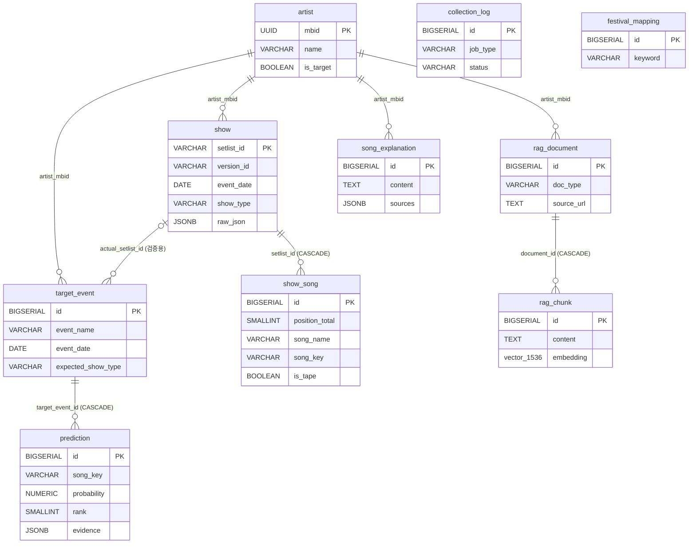

# 테이블설계서 — Soundcheck

- 프로젝트: Soundcheck (내한 페스티벌 셋리스트 예측 & 예습 서비스)
- 작성일: 2026-07-30
- 버전: v1.0
- DBMS: PostgreSQL 16 + pgvector (0.8.x)
- 작성 방식: **구현 완료된 프로토타입을 역설계**하여 문서화. DDL의 권위 원천은 Flyway 마이그레이션(`backend/src/main/resources/db/migration/` V1~V7)이며, JPA는 `ddl-auto: validate`로 스키마를 따라간다. 이 문서와 DDL이 불일치하면 DDL이 정답이다.
- 관련 문서: `/docs/setlist-schema.md`(설계 원본 + API 실측 검증), `/docs/design/process-spec.md`

---

## 1. 설계 원칙

| # | 원칙 | 적용 |
|---|------|------|
| 1 | 아티스트 식별자는 MusicBrainz **MBID** | `artist.mbid UUID PK`. 밴드 이름을 키로 쓰지 않음 |
| 2 | 외부 데이터 변경 감지는 `version_id` | setlist.fm은 위키 방식 — 같은 `setlist_id`라도 내용이 바뀜. 버전 동일 시 스킵 |
| 3 | 원본 보존 | 응답 원문을 `show.raw_json`(JSONB)에 보관 — 파싱 로직 수정 시 재수집 없이 재처리 |
| 4 | 손실 변환 분리 | 곡명은 원본(`song_name`)과 정규화 키(`song_key`)를 분리 저장. 집계는 `song_key` 기준 |
| 5 | 예측은 사전 계산 스냅샷 | `prediction`은 배치가 미리 계산해 저장, 조회는 읽기만. 지난 이벤트는 재계산하지 않음(스냅샷 고정) |
| 6 | DB가 마지막 방어선 | 화면에 그대로 노출되는 수치(확률 등)는 CHECK 제약으로 범위를 못박음 (V4) |
| 7 | 벡터 저장소 통합 | pgvector로 RDB와 벡터 검색을 한 DB에서 처리 — 인프라 단순화 |

## 2. ERD



- `collection_log.artist_mbid`는 의도적으로 **FK 미선언**(값 컬럼) — 아티스트 단위가 아닌 작업도 기록하므로 nullable 값으로 둔다.
- `rag_document.artist_mbid`, `song_explanation.artist_mbid`는 FK이지만 JPA에서는 연관관계가 아닌 UUID 값으로 매핑한다.

## 3. 테이블 목록

| 영역 | 테이블 | 목적 | 매핑 방식 |
|------|--------|------|-----------|
| 원천 | `artist` | 수집 대상 아티스트 (MBID 기준) | JPA `Artist` |
| 원천 | `show` | 공연 1회 = setlist.fm setlist 1건 | JPA `Show` |
| 원천 | `show_song` | 공연별 연주곡 (순서 포함) | JPA `ShowSong` |
| 원천 | `festival_mapping` | show_type 판정용 수동 키워드 | JPA `FestivalMapping` |
| 예측 | `target_event` | 예측 대상 공연 (예: 부산록페 - Megadeth) | JPA `TargetEvent` |
| 예측 | `prediction` | 곡별 예측 결과 (배치 사전 계산) | JPA `Prediction` |
| 운영 | `collection_log` | 배치 실행 이력 (수집/예측/임베딩 공용) | JPA `CollectionLog` |
| RAG | `rag_document` | RAG 문서 메타 (출처 포함) | JPA `RagDocument` |
| RAG | `rag_chunk` | 청크 + 임베딩 벡터 | **JdbcClient 직접** (vector 타입) |
| RAG | `song_explanation` | 곡 설명 생성 결과 캐시 | JPA 읽기 전용 + upsert SQL |

---

## 4. 테이블 상세

### 4.1 artist — 아티스트

MusicBrainz MBID를 PK로 하는 수집 대상 아티스트. (`Artist.java`, V1)

| 컬럼 | 타입 | Null | 기본값 | 설명 |
|------|------|:----:|--------|------|
| `mbid` | UUID | PK | | MusicBrainz MBID. 이름이 아닌 MBID가 유일 식별자 |
| `name` | VARCHAR(200) | N | | 표시용 이름 |
| `sort_name` | VARCHAR(200) | Y | | 정렬용 이름 |
| `setlist_fm_url` | TEXT | Y | | setlist.fm 아티스트 페이지 |
| `is_target` | BOOLEAN | N | FALSE | 수집 대상 여부. 배치는 `is_target = true`만 순회 |
| `created_at` | TIMESTAMPTZ | N | now() | 생성 시각 (`@CreationTimestamp`) |
| `updated_at` | TIMESTAMPTZ | N | now() | 수정 시각 (`@UpdateTimestamp`) |

### 4.2 show — 공연

setlist.fm의 setlist 1건 = 공연 1회. (`Show.java`, V1)

| 컬럼 | 타입 | Null | 기본값 | 설명 |
|------|------|:----:|--------|------|
| `setlist_id` | VARCHAR(20) | PK | | setlist.fm setlist ID |
| `version_id` | VARCHAR(20) | N | | 편집 버전 — **변경 감지 키** (영문자 포함 문자열, 실측 확인). JPA 낙관적 락 아님 |
| `artist_mbid` | UUID | N | | FK → `artist(mbid)` |
| `event_date` | DATE | N | | 공연일. 원본 `dd-MM-yyyy` 문자열을 STRICT 파싱해 DATE로 저장 |
| `tour_name` | VARCHAR(200) | Y | | 투어명 (실측: 100건 중 17건 누락 → nullable) |
| `venue_name` | VARCHAR(300) | Y | | 공연장 |
| `city_name` | VARCHAR(200) | Y | | 도시 |
| `country_code` | CHAR(2) | Y | | ISO 국가 코드. 내한 감지(KR 필터)에 사용 |
| `show_type` | VARCHAR(20) | N | 'UNKNOWN' | `SOLO` \| `FESTIVAL` \| `UNKNOWN`. 페스티벌 셋은 곡 수가 짧아 예측 가중에 사용 |
| `song_count` | SMALLINT | N | 0 | 연주곡 수 (재적재 시 갱신). 0건 공연은 집계 제외 |
| `source_url` | TEXT | Y | | setlist.fm 페이지 링크 (출처 표기용) |
| `raw_json` | JSONB | N | | **응답 원문 보관** — 파서 수정 시 재수집 없이 재처리 |
| `collected_at` | TIMESTAMPTZ | N | now() | 수집 시각 (도메인 코드가 직접 관리) |

**인덱스**

| 이름 | 컬럼 | 용도 |
|------|------|------|
| `idx_show_artist_date` | (artist_mbid, event_date DESC) | 최근 공연 표본 조회 (예측·타임라인) |
| `idx_show_type` | (artist_mbid, show_type, event_date DESC) | 유형별 통계 (페스티벌 평균 곡 수 등) |

### 4.3 show_song — 공연별 연주곡

공연 내 곡 순서를 보존하는 자식 테이블. (`ShowSong.java`, V1 + V2)

| 컬럼 | 타입 | Null | 기본값 | 설명 |
|------|------|:----:|--------|------|
| `id` | BIGSERIAL | PK | | |
| `setlist_id` | VARCHAR(20) | N | | FK → `show` **ON DELETE CASCADE** |
| `set_index` | SMALLINT | N | | 0=본편, 1..n=앙코르 순번 |
| `is_encore` | BOOLEAN | N | FALSE | 앙코르 여부 |
| `position_in_set` | SMALLINT | N | | 셋 내 순번 |
| `position_total` | SMALLINT | N | | 공연 전체 기준 순번 (1부터) |
| `song_name` | VARCHAR(300) | N | | **원본 표기** (손실 변환 복구용) |
| `song_key` | VARCHAR(300) | N | | **정규화 키** — 집계 기준 (§7 정규화 규칙) |
| `is_cover` | BOOLEAN | N | FALSE | 커버곡 여부. 실제 연주이므로 **예측에 포함** |
| `cover_artist` | VARCHAR(200) | Y | | 원곡 아티스트 |
| `is_tape` | BOOLEAN | N | FALSE | 음원 재생(입·퇴장곡). **예측 집계 제외** — 저장은 하되 집계 단계에서 거름 |
| `note` | TEXT | Y | | 곡 단위 메모 (게스트 등) |

**제약/인덱스**

| 이름 | 정의 | 비고 |
|------|------|------|
| `uq_show_song` | UNIQUE (setlist_id, position_total) **DEFERRABLE INITIALLY DEFERRED** | V2에서 인덱스 → 테이블 제약으로 변경. 재적재가 곡 목록을 통째로 교체할 때 Hibernate가 자식 INSERT를 orphan DELETE보다 먼저 실행하므로, 검사를 커밋 시점으로 미뤄야 충돌하지 않음. UNIQUE INDEX는 DEFERRABLE 불가 |
| `idx_show_song_key` | (song_key) | 곡 단위 집계 |

### 4.4 festival_mapping — 페스티벌 키워드 (V5)

venue/tour명에 "festival"/"페스티벌"이 없는 페스티벌 공연장(예: 삼락생태공원)을 운영자가 등록. 판정 로직은 내장 키워드 + 이 테이블을 합쳐 대소문자·전각 무시(NFKC) 부분 일치로 FESTIVAL 판정한다.

| 컬럼 | 타입 | Null | 설명 |
|------|------|:----:|------|
| `id` | BIGSERIAL | PK | |
| `keyword` | VARCHAR(300) | N | UNIQUE (`uq_festival_mapping_keyword`) |

### 4.5 target_event — 예측 대상 이벤트

"이 공연에서 뭘 연주할까"의 대상. (`TargetEvent.java`, V1)

| 컬럼 | 타입 | Null | 설명 |
|------|------|:----:|------|
| `id` | BIGSERIAL | PK | |
| `artist_mbid` | UUID | N | FK → `artist(mbid)` |
| `event_name` | VARCHAR(200) | N | 예: '2026 부산국제록페스티벌' |
| `event_date` | DATE | N | 공연일 (과거 날짜 등록은 API가 거부) |
| `venue_name` | VARCHAR(300) | Y | |
| `expected_show_type` | VARCHAR(20) | N | FESTIVAL \| SOLO. **UNKNOWN 금지** (도메인 불변식 — 예측 가중의 기준이므로) |
| `expected_song_count` | SMALLINT | Y | 예상 곡 수 |
| `actual_setlist_id` | VARCHAR(20) | Y | FK → `show`. **공연 후 자동 매칭**으로 채워짐 → 적중률 검증. 채워지면 화면이 "검증 모드"로 전환 |
| `trend_summary` | TEXT | Y (V8) | 예측 변화 LLM 요약(E4) — 예측 재계산 시에만 갱신, 변화 곡 없으면 NULL(LLM 미호출) |
| `trend_summary_at` | TIMESTAMPTZ | Y (V8) | 요약 생성 시각 |

**제약**: UNIQUE (artist_mbid, event_date) — 같은 아티스트의 같은 날 이벤트 중복 방지 (위반 시 API 409)

### 4.6 prediction — 곡별 예측 결과

배치가 사전 계산해 저장하는 스냅샷. 재계산 시 이벤트 단위로 **전체 교체**(벌크 DELETE → INSERT). (`Prediction.java`, V1 + V4)

| 컬럼 | 타입 | Null | 설명 |
|------|------|:----:|------|
| `id` | BIGSERIAL | PK | |
| `target_event_id` | BIGINT | N | FK → `target_event` **ON DELETE CASCADE** |
| `song_key` | VARCHAR(300) | N | 정규화 곡 키 |
| `song_name` | VARCHAR(300) | N | 표시용 — 최근 공연에서 처음 만난 원본 표기 |
| `probability` | NUMERIC(5,4) | N | 연주 확률 0.0000~1.0000 (scale 4, HALF_UP) |
| `rank` | SMALLINT | N | 확률 내림차순 → 연주 횟수 내림차순 → song_key 오름차순 (결정적 정렬), 1부터 |
| `played_count` | SMALLINT | N | 근거: 표본 N회 중 연주 횟수 |
| `sample_size` | SMALLINT | N | 근거: 표본 크기 N (기본 20) |
| `avg_position` | NUMERIC(4,1) | Y | 평균 셋 내 위치 (scale 1) |
| `encore_ratio` | NUMERIC(5,4) | Y | 앙코르 등장 비율 |
| `evidence` | JSONB | Y | 계산 상세: `{recencyDecay, matchingShowTypeBoost, weightedScore, totalWeight, baseFrequency, unboostedProbability, recentCount5, trend(RISING\|STABLE\|FALLING), positionStats{opener,early,mid,late,encore}, typeBreakdown{festivalShows,festivalPlayed,soloShows,soloPlayed}, appearances[{setlistId, eventDate, weight, positionTotal, encore}]}` — Explainable AI(E1)·위치 분석(E3)·변화 분석(E4) 원천 데이터. **appearances는 곡이 실제 연주된 공연만**(미등장 공연 미포함, 최근순). `unboostedProbability` 이하는 v0.2 확장분 — 이전 스냅샷에는 없고 역직렬화 시 null |
| `computed_at` | TIMESTAMPTZ | N | 계산 시각 |

**제약/인덱스** — 예측 수치는 화면에 그대로 노출되므로 DB가 마지막 방어선 (V4)

| 이름 | 정의 |
|------|------|
| UNIQUE | (target_event_id, song_key) |
| `idx_prediction_rank` | (target_event_id, rank) — 확률순 목록 조회 |
| `ck_prediction_probability` | probability ∈ [0, 1] |
| `ck_prediction_encore_ratio` | encore_ratio IS NULL OR ∈ [0, 1] |
| `ck_prediction_played_within_sample` | 0 ≤ played_count ≤ sample_size |

### 4.6a llm_call_log — LLM 호출 이력 (E9, V9)

호출마다 1행. 비용·지연·캐시 효율을 관리자 대시보드(`/api/admin/ai-dashboard`)에서 오늘(KST) 기준으로 집계한다. (`LlmCallLog.java`)

| 컬럼 | 타입 | Null | 설명 |
|------|------|:----:|------|
| `id` | BIGSERIAL | PK | |
| `call_type` | VARCHAR(30) | N | EXPLANATION \| CHAT \| TREND_SUMMARY \| EMBEDDING |
| `model` | VARCHAR(100) | Y | 제공자 메타데이터의 모델명 |
| `input_tokens` / `output_tokens` | INT | Y | usage 메타데이터 없으면(스트리밍) NULL — 비용 집계는 있는 값만 합산 |
| `latency_ms` | INT | N | |
| `cache_hit` | BOOLEAN | N | EXPLANATION 캐시 히트는 LLM 미호출 행으로 기록 |
| `error_message` | TEXT | Y | NULL = 성공 |
| `created_at` | TIMESTAMPTZ | N | 인덱스 `(created_at DESC)` |

계측은 `LlmCallRecorder`가 하며 **절대 예외를 던지지 않는다** — 계측 실패가 원 기능을 깨면 안 된다.

### 4.6b song_video — 재생목록 영상 캐시 (E12, V10)

곡별 YouTube 대표 영상 ID. `video_id` NULL = 검색했지만 못 찾음(**네거티브 캐시** — 재검색으로 쿼터를 태우지 않는다). (`SongVideo.java`)

| 컬럼 | 타입 | Null | 설명 |
|------|------|:----:|------|
| `id` | BIGSERIAL | PK | |
| `artist_mbid` | UUID | N | FK → `artist` |
| `song_key` | VARCHAR(300) | N | UNIQUE (artist_mbid, song_key) |
| `video_id` / `video_title` | VARCHAR | Y | YouTube Data API search 결과 관련도 1위 |
| `searched_at` | TIMESTAMPTZ | N | |

### 4.7 collection_log — 배치 실행 이력

수집(SETLIST_SYNC)/예측(PREDICT)/임베딩(EMBED) 공용 이력. 진행 중 상태는 없고 **완료 시점에 1건 기록**하는 모델. (`CollectionLog.java`, V1 + V3)

| 컬럼 | 타입 | Null | 설명 |
|------|------|:----:|------|
| `id` | BIGSERIAL | PK | |
| `artist_mbid` | UUID | Y | 값 컬럼(FK 아님) — 아티스트 단위가 아닌 작업 존재 |
| `job_type` | VARCHAR(30) | N | SETLIST_SYNC \| PREDICT \| EMBED |
| `status` | VARCHAR(20) | N | SUCCESS \| PARTIAL \| FAILED |
| `fetched_count` | INT | N (V3) | job_type별 의미 상이 — 아래 표 |
| `updated_count` | INT | N (V3) | 〃 |
| `skipped_count` | INT | N (V3) | 〃 |
| `error_message` | TEXT | Y | 부분 실패 시 오류 메시지 `;` 결합 |
| `started_at` | TIMESTAMPTZ | N | |
| `finished_at` | TIMESTAMPTZ | Y | 코드상 항상 기록 시점에 채움 |

> V3에서 카운트 3종을 NOT NULL DEFAULT 0으로 강제 — 세 컬럼 모두 NULL이면 JPA `@Embedded`(CollectionCounts)가 통째로 null이 되어 읽는 쪽 NPE 발생.

**job_type별 카운트 의미** (운영 화면 해석 기준)

| job_type | 기록 단위 | fetched | updated | skipped |
|----------|-----------|---------|---------|---------|
| SETLIST_SYNC | 아티스트 1팀당 1건 | 수집한 셋리스트 수 | 신규+갱신 수 | versionId 동일 스킵 수 |
| PREDICT | 이벤트 1건당 1건 | 표본 공연 수 | 저장한 예측 곡 수 | 0 |
| EMBED | 아티스트 1팀당 1건 | 저장 문서 수 | 저장 청크 수 | 중복 URL/검색 실패 수 |

### 4.8 rag_document — RAG 문서 메타 (V6)

Wikipedia 등에서 수집한 문서의 메타데이터. 출처 표기가 필수 요구사항이므로 `source_url` NOT NULL.

| 컬럼 | 타입 | Null | 설명 |
|------|------|:----:|------|
| `id` | BIGSERIAL | PK | |
| `artist_mbid` | UUID | N | FK → `artist(mbid)` (JPA에서는 UUID 값으로 매핑) |
| `song_key` | VARCHAR(300) | Y | 곡 단위 문서만 채움. 앨범/아티스트 문서는 NULL |
| `doc_type` | VARCHAR(30) | N | SONG \| ALBUM \| ARTIST |
| `title` | VARCHAR(300) | N | 문서 제목 |
| `source_name` | VARCHAR(200) | N | 출처명 (예: Wikipedia(en)) |
| `source_url` | TEXT | N | 출처 URL — 답변에 항상 함께 반환 |
| `collected_at` | TIMESTAMPTZ | N | |

**제약/인덱스**

| 이름 | 정의 | 용도 |
|------|------|------|
| UNIQUE | (artist_mbid, source_url) | 재수집 스킵 기준 — 여러 곡이 같은 앨범 문서로 수렴하는 경우 중복 방지 |
| `idx_rag_document_filter` | (artist_mbid, song_key) | 검색 필터 |

### 4.9 rag_chunk — 청크 + 임베딩 (V6)

**JPA 엔티티 없이 JdbcClient로 직접 접근** — `vector` 타입은 Hibernate 표준 매핑이 없어 SQL이 더 명확하다.

| 컬럼 | 타입 | Null | 설명 |
|------|------|:----:|------|
| `id` | BIGSERIAL | PK | |
| `document_id` | BIGINT | N | FK → `rag_document` **ON DELETE CASCADE** |
| `chunk_index` | SMALLINT | N | 문서 내 순번 |
| `content` | TEXT | N | 청크 본문 (목표 650토큰, CL100K_BASE 기준) |
| `embedding` | vector(1536) | N | OpenAI `text-embedding-3-small` (차원 수는 설정과 일치 필수) |
| `token_count` | SMALLINT | Y | 청크 토큰 수 |

**제약/인덱스**

| 이름 | 정의 | 용도 |
|------|------|------|
| UNIQUE | (document_id, chunk_index) | |
| `idx_rag_chunk_embedding` | **HNSW** (embedding vector_cosine_ops) | 코사인 유사도 근사 최근접 검색 |

검색 쿼리 개요: `score = 1 - (embedding <=> :query)`, 필터 `artist_mbid = ? AND (song_key = ? OR doc_type <> 'SONG') AND score >= min_score(0.35)`, `ORDER BY 거리 LIMIT top_k(5)` — 곡 문서는 해당 곡만, 앨범·아티스트 문서는 공용 배경으로 항상 후보에 포함.

### 4.10 song_explanation — 곡 설명 캐시 (V7)

RAG 생성 결과 캐시. 원천은 항상 `rag_chunk` 검색+생성이며, 새 문서 수집 시 **아티스트 단위로 무효화**된다. 쓰기는 `INSERT ... ON CONFLICT DO NOTHING`(동시 생성 경합 시 첫 저장만 유지), JPA 매핑은 읽기 전용.

| 컬럼 | 타입 | Null | 설명 |
|------|------|:----:|------|
| `id` | BIGSERIAL | PK | |
| `artist_mbid` | UUID | N | FK → `artist(mbid)` |
| `song_key` | VARCHAR(300) | N | |
| `content` | TEXT | N | 생성된 설명 본문 ("정보 없음"과 빈 본문은 캐시하지 않음) |
| `sources` | JSONB | N | `[{name, url, title}]` — 본문의 `[n]` 표기와 순서 일치 |
| `generated_at` | TIMESTAMPTZ | N | |

**제약**: UNIQUE (artist_mbid, song_key)

---

## 5. 마이그레이션 이력

| 버전 | 파일 | 내용 | 배경 |
|------|------|------|------|
| V1 | `V1__init.sql` | artist, show, show_song, target_event, prediction, collection_log | 초기 스키마 |
| V2 | `V2__defer_show_song_position_unique.sql` | `uq_show_song`을 DEFERRABLE 테이블 제약으로 변경 | 재적재 시 Hibernate INSERT/DELETE 순서로 인한 유니크 충돌 해소 |
| V3 | `V3__collection_log_counts_not_null.sql` | 카운트 3종 NOT NULL DEFAULT 0 | `@Embedded` 전체 null → NPE 방지 |
| V4 | `V4__prediction_invariants.sql` | prediction CHECK 3종 | NUMERIC(5,4)는 9.9999까지 허용 — 범위를 DB에서 못박음 |
| V5 | `V5__festival_mapping.sql` | festival_mapping | 키워드 없는 페스티벌 공연장 수동 등록 |
| V6 | `V6__rag.sql` | vector 확장, rag_document, rag_chunk, HNSW 인덱스 | RAG 파이프라인 |
| V7 | `V7__song_explanation_cache.sql` | song_explanation | LLM 생성 결과 캐시 (비용·지연 절감) |

예정(구현 계획 기준): V8 `target_event.trend_summary`(P2), V9 `llm_call_log`(P3).

---

## 6. 데이터 흐름 요약

```
setlist.fm API ─(수집 배치)→ show + show_song (+ raw_json 원본 보존)
                              │
                              ├─(예측 배치)→ prediction  ←─ target_event (관리자 등록)
                              └─(공연 후 자동 매칭)→ target_event.actual_setlist_id
Wikipedia ─(RAG 수집)→ rag_document + rag_chunk(임베딩)
                              └─(조회 시 검색+생성)→ song_explanation (캐시)
모든 배치 ─→ collection_log
```

## 7. 곡명 정규화 규칙 (`song_key`)

집계 정확도를 좌우하는 핵심 규칙 (`SongKeys.normalize()`, 단위 테스트 필수 대상):

1. NFKC 유니코드 정규화(전각/반각 통일) → 소문자 → 트림
2. 괄호 부가정보 제거 — **화이트리스트 방식**: 괄호 안이 `live|acoustic|reprise|remaster(ed)|demo|instrumental|unplugged`로 시작할 때만 제거. `(Part II)`처럼 다른 곡을 구분하는 정보는 보존
3. 아포스트로피 삭제 (don't → dont), 나머지 구두점은 **공백 치환** (Knife-Edge → knife edge — 하이픈 표기와 띄어쓰기 표기를 같은 키로)
4. 연속 공백 1칸 압축
5. 결과가 빈 문자열이면(제목이 `"?"` 등 구두점뿐) 2단계 상태(NFKC+소문자, 괄호·구두점 유지)로 폴백
6. 선행 관사는 유지 (`The Stage` ≠ `Stage`인 사례 존재)
